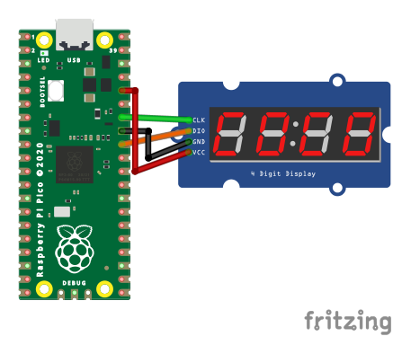

# Raspberry Pi Pico - TM1637 7-Segment Displays Library

This repository contains a Raspberry Pi Pico library using its SDK writen for the 7-Degment Displays that are equiped with an TM1637 module. It also contains one example. Below are the instructions on how to build it.

## Example

After you clone the repo you run the following commands to build it. You have to have installed *CMake* and *Make*. Also you need to have the SDK on your system and point `PICO_SDK_PATH` to it.
```sh
export PICO_SDK_PATH='/Path/to/SDK'
```
```sh
cd Pico-TM1637/example
```
```sh
mkdir build
```
```sh
cd build
```
```sh
cmake ..
```
```sh
make -j4
```
### How to connect the LCD to the board

